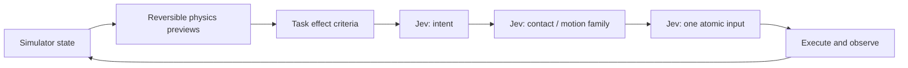

<div align="center">


**Explore robot control with Jev, local physics previews, and configurable tasks.**

[](https://github.com/Dimweaker/jev-libero/actions/workflows/tests.yml)
[](pyproject.toml)
[](LICENSE)

[**Open the interactive Decision Lab ↗**](https://dimweaker.github.io/jev-libero/)

[Demos](#demos) · [Quick start](#quick-start) · [How it works](#how-it-works) · [Results](#recorded-results) · [Task configs](#configure-your-own-task) · [简体中文](README.zh-CN.md)

</div>

## Demos

<table>
<tr><th align="center">Close the microwave</th><th align="center">Close the top drawer</th></tr>
<tr>
<td align="center"><a href="docs/media/microwave.mp4"></a></td>
<td align="center"><a href="docs/media/top-drawer.mp4"></a></td>
</tr>
<tr><td align="center">14 decisions · 111 environment steps<br/><a href="docs/media/microwave.mp4">MP4</a> · <a href="examples/records/microwave_seed1">Full record</a></td><td align="center">20 decisions · 155 environment steps<br/><a href="docs/media/top-drawer.mp4">MP4</a> · <a href="examples/records/top_drawer_seed1">Full record</a></td></tr>
<tr><th colspan="2">Grasp and lower alphabet soup into the basket</th></tr>
<tr><td colspan="2" align="center"><a href="docs/media/alphabet-soup.mp4"></a><br/>40 decisions · 314 environment steps<br/><a href="docs/media/alphabet-soup.mp4">MP4</a> · <a href="examples/records/alphabet_soup_seed1">Full record</a></td></tr>
</table>

Three LIBERO task configurations share one control engine. Videos follow simulation time, with decision and physics-preview waiting omitted.

[**Explore the interactive replay — follow Jev’s choices and probabilities alongside each video ↗**](https://dimweaker.github.io/jev-libero/)

## Features

- **Fine-grained control.** 27 inputs covering Cartesian translations, wrist rotations, gripper open/close, and hold.
- **Layered decisions.** Jev selects an intent, a contact/motion family, and an input, with each choice informing the next.
- **Local physics previews.** Reversible simulator branches evaluate candidate effects before execution.
- **Configurable tasks.** Select measurements, exported features, contact rules, goals, and per-layer Jev inputs in JSON through one shared interface.
- **Inspectable runs.** Save model requests, predictions, controls, simulator states, costs, and trajectory media together.

## Quick start

### 1 · Install

Use Python 3.10 or 3.11 in your preferred environment:

```bash
git clone https://github.com/Dimweaker/jev-libero.git
cd jev-libero
pip install -e .

jev-libero tasks
jev-libero inspect examples/records/top_drawer_seed1
```

The core package lets you browse tasks and recorded results. To run episodes, connect a LIBERO environment next.

### 2 · Connect LIBERO

Already have a compatible LIBERO / robosuite / MuJoCo environment? Keep your simulator dependencies, add the geometry libraries, and point the package to your checkout:

```bash
pip install python-fcl scipy
export LIBERO_ROOT=/path/to/LIBERO
export MUJOCO_GL=egl
```

<details>
<summary>Starting fresh? Use the demo environment as a reference</summary>

```bash
pip install torch==2.2.0 --index-url https://download.pytorch.org/whl/cpu
pip install -e '.[robot]'

git clone https://github.com/Lifelong-Robot-Learning/LIBERO.git ../LIBERO
git -C ../LIBERO checkout 8f1084e3132a39270c3a13ebe37270a43ece2a01
export LIBERO_ROOT="$(cd ../LIBERO && pwd)"
export MUJOCO_GL=egl
```

This installs the simulator versions used for the included recordings. CPU PyTorch is sufficient; LIBERO supplies the task definitions, assets, and initial states.

</details>

Use EGL for off-screen rendering, or add `--no-render` to save controls and states without camera output. See [setup](docs/setup.md) for dependency and renderer options.

### 3 · Choose an API and run

**Official TypeSafe API** — [get a key](https://console.typesafe.ai/settings/keys) · [API docs](https://docs.typesafe.ai/introduction/quickstart)

```bash
export TYPESAFE_API_KEY_FILE=/path/to/private/typesafe.key
# Or set TYPESAFE_API_KEY in your environment.

jev-libero run --provider typesafe --task top_drawer --seed 1 \
  --out runs/drawer-s1 --max-decisions 100 --budget-usd 0.10
```

**OpenRouter** — [get a key](https://openrouter.ai/)

```bash
export OPENROUTER_API_KEY_FILE=/path/to/private/openrouter.key
# Or set OPENROUTER_API_KEY in your environment.

jev-libero run --provider openrouter --task microwave --seed 1 \
  --out runs/microwave-s1 --max-decisions 100 --budget-usd 0.10
```

Both routes use the same control pipeline. TypeSafe calls `/v1/systemone` with `jev-latest`; OpenRouter uses `typesafe/jev-1.13` and is the CLI default.

**OpenAI-compatible gateway / relay**

This fork also includes a small streaming adapter for gateways that expose an OpenAI Responses-compatible endpoint. The gateway URL, model name, and credential are supplied at runtime through environment variables; they are not stored in the repository.

```bash
export BXI_BASE_URL="https://your-gateway.example/v1/responses"
export BXI_MODEL="gpt-5.6-sol"
export BXI_API_KEY_FILE=/path/to/private/gateway.key
# Or set BXI_API_KEY in the environment.

jev-libero run --provider bxi --task top_drawer --seed 1 \
  --out runs/gateway-drawer-s1 --max-decisions 40 --budget-usd 0.10
```

The adapter expects a streaming Responses API (`stream: true`) and converts the model's JSON choice back into Jev's layered decision format. The gateway must return text that contains a choice such as `{"choice":"..."}`. Use a new output directory for every run. Gateway availability, model limits, and usage pricing are controlled by the gateway provider.

Choose a new output directory for each episode. `--max-decisions` bounds its length, and `--budget-usd` sets a client-side spending guard. Runs use paid API calls: OpenRouter reports costs directly; TypeSafe costs are estimated from token usage. [API setup and billing details →](docs/setup.md#official-api)

## Configure your own task

Use the bundled tasks as starting points, or pass your own JSON file:

```bash
cp src/jev_libero/tasks/top_drawer.json my-task.json
# Edit the task binding, goals, measurements, and prompts.
jev-libero validate-task my-task.json
jev-libero run --provider typesafe --task my-task.json --out runs/custom
```

[`microwave.json`](src/jev_libero/tasks/microwave.json), [`top_drawer.json`](src/jev_libero/tasks/top_drawer.json), and [`alphabet_soup.json`](src/jev_libero/tasks/alphabet_soup.json) use the same measurement interface. `measurements` selects what to compute, `features` selects what to expose, and `policy` selects what each Jev layer receives; `record_features` selects per-step logging. No task-specific executor is needed. See the [configuration guide](docs/tasks.md).

Run the grasp task with:

```bash
jev-libero run --provider typesafe --task alphabet_soup --seed 1 \
  --out runs/soup-s1 --max-decisions 60 --budget-usd 0.03
```

## How it works



The engine reads simulator state and previews each input for up to **8 environment steps / 0.4 simulation seconds**. MuJoCo supplies the dynamics, FCL measures collision-shape distances, and the task configuration determines which effects qualify.

Jev chooses among those candidates. If a useful move needs repositioning first, two-step previews look for a route to the desired effect. The controller executes one selected input, observes the result, and chooses again.

[Architecture and implementation details →](docs/architecture.md)

## Recorded results

One recorded example passing the original LIBERO criterion per bundled task:

| Task | Seed | Outcome | Decisions | Env steps | API cost |
|---|---:|:---:|---:|---:|---:|
| Microwave | 1 | ✅ | 14 | 111 | $0.001249 |
| Top drawer | 1 | ✅ | 20 | 155 | $0.001418 |
| Alphabet soup | 1 | ✅ | 40 | 314 | ~$0.003023 |

All use saved initial-state index 0. Microwave and drawer use OpenRouter; soup uses TypeSafe, with cost estimated from input-token pricing. Costs cover model calls. [Run records and analysis →](docs/results.md)

### Replay a recording

To inspect an existing trajectory, use the reference environment above and run:

```bash
jev-libero replay examples/records/top_drawer_seed1
```

Replay applies the saved controls and checks the resulting states and task outcome, without API calls. The [environment reference](docs/setup.md#tested-simulation-stack) lists the versions used to create these recordings.

## Development

```bash
pip install -e '.[dev]'
ruff check src tests tools
ruff format --check src tests tools
pytest
pytest --simulation  # optional physics checks with LIBERO configured
```

Tests use mock or recorded API responses. The simulation suite covers control replay, geometry, snapshot restoration, and two-step previews.

```text
src/jev_libero/      # API client, policy, simulator, and CLI
  tasks/            # bundled task definitions
examples/records/   # recorded episodes
tests/              # core and simulation tests
docs/               # guides and demo media
```

The [Decision Lab website](site/README.md) has its own static build and browser checks.

Want to report a bug or improve the code? See [how to contribute](CONTRIBUTING.md).

[Third-party acknowledgements](THIRD_PARTY.md) · [MIT License](LICENSE)

Built on [LIBERO](https://github.com/Lifelong-Robot-Learning/LIBERO), [robosuite](https://github.com/ARISE-Initiative/robosuite), [MuJoCo](https://github.com/google-deepmind/mujoco), [python-fcl](https://github.com/BerkeleyAutomation/python-fcl), and [TypeSafe Jev](https://typesafe.ai). Decision-interface inspiration: [Typesafe Mario](https://github.com/fhshaik/typesafe-mario).
